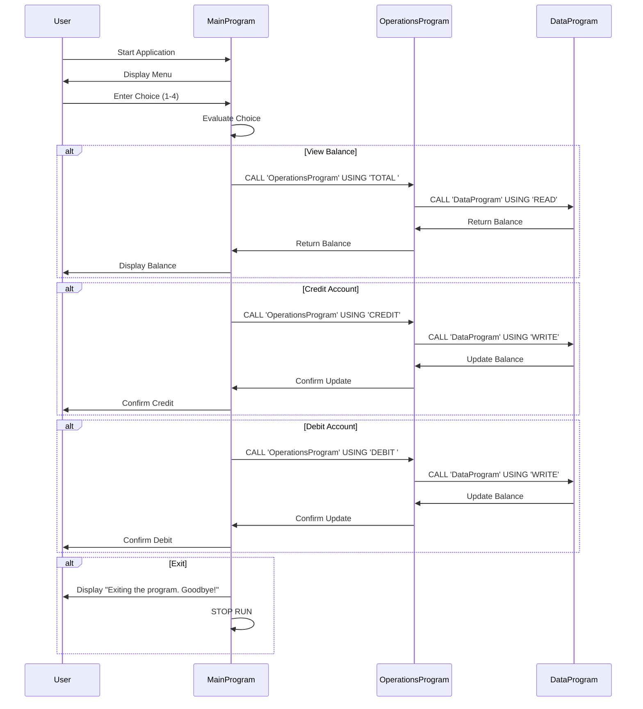

# Cobol-Accounting-System
This repo contains COBOL code for a simple accounting system. You can use GitHub Copilot to transform this code to any programming language. I have listed steps on how to transform the code to Node.js in my blog here : https://medium.com/@tajinder.singh1985/modernizing-legacy-upgrading-a-cobol-accounting-app-to-node-js-using-github-copilot-812ed95f426a

## About the program
This COBOL program simulates an account management system. This program will involve multiple COBOL source files and perform various operations like crediting, debiting, viewing the balance, and even exiting the program. Here’s how you its structured:

- Main Program (main.cob): The main program will handle the user interface and call subprograms for different operations.
- Operations Program (operations.cob): This program will handle the actual operations like credit, debit, and view balance.
- Data Storage Program (data.cob): This program will manage the storage of the account balance.

## Steps to Compile and Run the Program

- Install COBOL compiler on MaC
If you don't already have a COBOL compiler, you'll need to install one. Common COBOL compiler is GnuCOBOL: An open-source COBOL compiler. To Install , use brew:
  ```
  brew install gnucobol 
  ```
link here : https://formulae.brew.sh/formula/gnucobol

- Compile each program separately as they will be linked together during runtime.
  ```
  cobc -c main.cob -o main.o
  cobc -c operations.cob -o operations.o
  cobc -c data.cob -o data.o
  
  ```
- Link and Create Executable: Link the object files together to create the final executable:
  ```
  cobc -x main.o operations.o data.o -o accountsystem
  
  ```
- Run the Program: Run the executable to start the account management system:
  ```
  ./accountsystem

  ```

## Program Interaction Example
- Program starts with user input menu
  ```
  --------------------------------
  Account Management System
  1. View Balance
  2. Credit Account
  3. Debit Account
  4. Exit
  --------------------------------
  Enter your choice (1-4): 
  ```
- User Chooses to View Balance:
  ```
  Current balance: 1000.00
  ```
- User Chooses to Credit:
  ```
  Enter credit amount:
  200.00
  Amount credited. New balance: 1200.00
  ```
- User Chooses to Debit:
  ```
  Enter debit amount:
  300.00
  Amount debited. New balance: 900.00
  ```
- User Chooses to Exit:
  ```
  Exiting the program. Goodbye!
  ```
## Explanation:
- main.cob: This is the main interface where users select operations.
- operations.cob: It handles specific operations such as viewing, crediting, and debiting the account balance.
- data.cob: This program acts as a simple data storage, handling reading and writing of the balance.

This multi-file structure introduces modularity, making it easier to manage and extend the program. Each file has a clear responsibility, and the program flow is driven by user interaction.

## Data Flow


